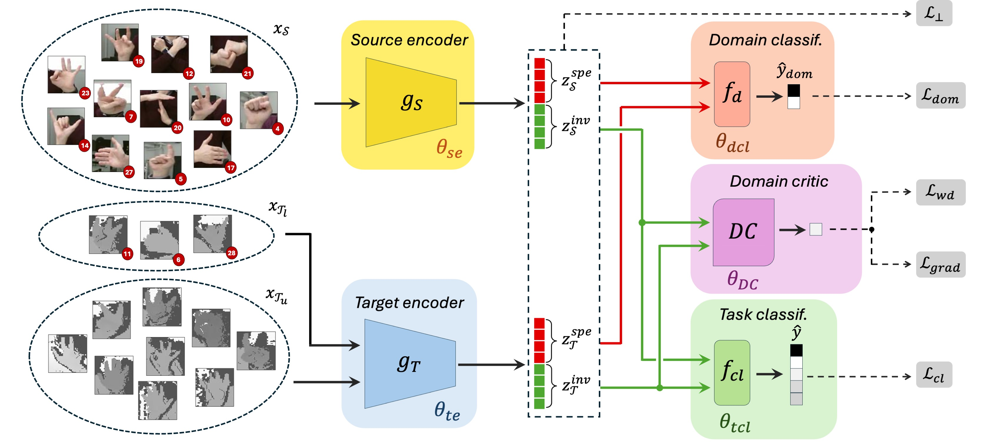

# DASH-DA: A new Adversarial Disentanglement Framework for Semi-Supervised Heterogeneous Domain Adaptation

## Framework overview 

**Considered setting:** The key challenge in Semi-Supervised Domain Adaptation lies in transferring knowledge from a source domain with abundant labeled data to a target domain with scarce labeled and abundant unlabeled data. This task is challenging due to potential distribution shifts, but the complexity further increases when source and target data differ in modality representation, such as when they are captured using different sensors (e.g., RGB and thermal cameras). This scenario, known as Semi-Supervised Heterogeneous Domain Adaptation (SSHDA), introduces an even more severe distribution shift due to modality differences across domains.

**Proposed approach:** To address these challenges, we propose DASH-DA (Disentangled Adversarial Semi-supervised Heterogeneous Domain Adaptation), an end-to-end neural framework designed to disentangle domain-invariant features, which are essential for the downstream task, from domain-specific features that may hinder cross-modality transfer. Additionally, to further strengthen the domain invariance of the extracted features, we incorporate an adversarial learning term based on Wasserstein distance. We evaluate our framework on three multi-modal benchmarks: SUN RGB-D, TRISTAR, and HANDS. Extensive experiments demonstrate that DASH-DA outperforms both baselines and state-of-the-art (SoTA) SSHDA approaches in challenging scenarios featured by minimal label supervision on the target data, across diverse backbones architectures.

## Code organization

Train and test of the proposed framework are performed in file `main.py`.
Our framework has been implemented using two different backbone architectures: *ResNet-18* (`backbone_resnet.py`) and *TinyViT* (`backbone_vit.py`). Auxiliary functions are provided in `functions.py`, while parameters and hyperparameters are stored in `param.py`.

### Data
To prepare the data for use with our framework, first download the original datasets and normalize them according to your application requirements. Once preprocessed, place the dataset (including both modality files and the label file) in a folder named ./Datasets/dataset_name.

Finally, run `preproc.py` to generate the necessary data files.

### Input arguments 
Scripts take the following input arguments in order (they are used for data loading configuration and may be modified to meet your own dataset conventions):
1) Dataset name (SUNRGBD, TRISTAR or HANDS);
2) Source data prefix: identifies which data will serve as source domain modality. E.g.: *RGB* or *DEPTH* (for the *SUN RGBD* benchmark) and *THERMAL* or *DEPTH* (for the *TRISTAR* benchmark). The script will consider the unselected modality as Target;
3) Backbone architecture name (ResNet-18 or TinyViT);
4) GPU number; 
5) Number of labeled samples on the target domain. E.g.: 5, 10, 25, 50, or a combination of them;
6) Split number: choose a different train-test split. E.g.: 0, 1, 2, 3, 4, or a combination of them.

*   Example of running istruction:

<!---->

    python main.py -d SUNRGBD -s DEPTH -b ResNet-18 -n_gpu 1 -ns 5 10 50 -np 1 2 5

